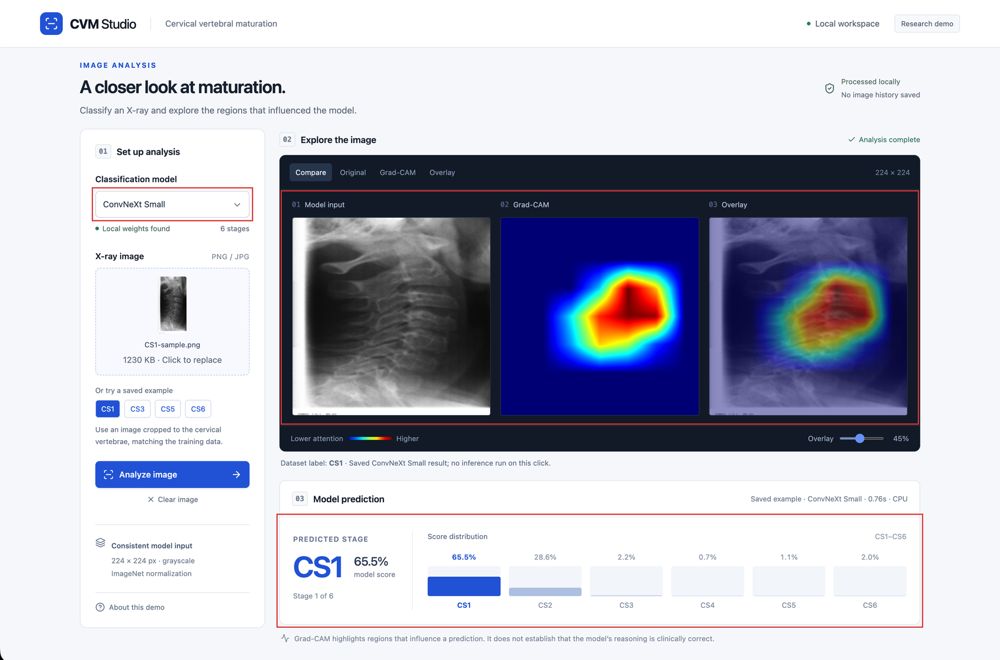
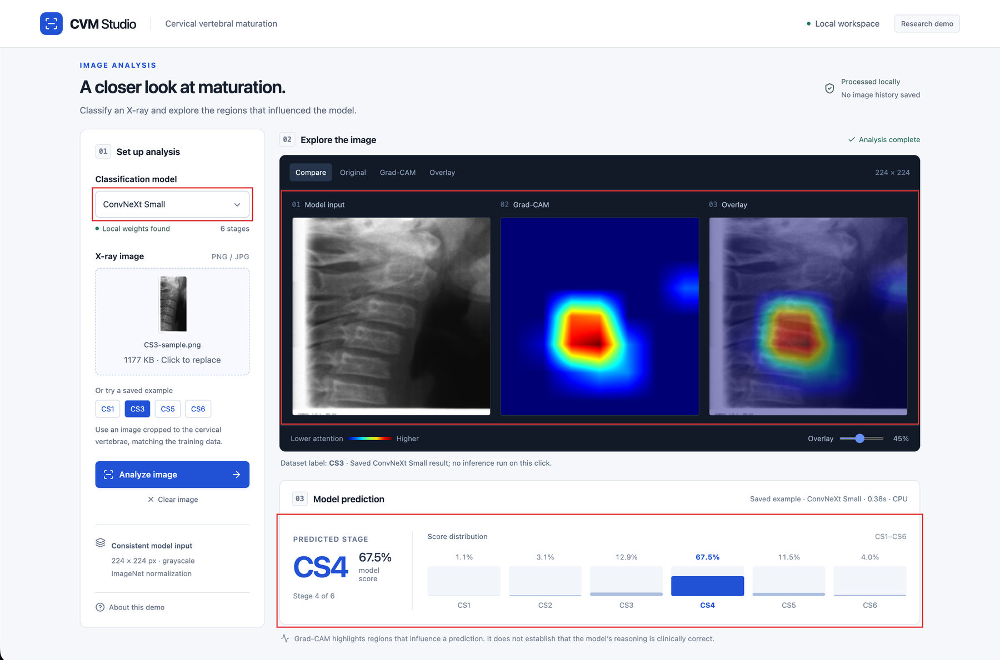
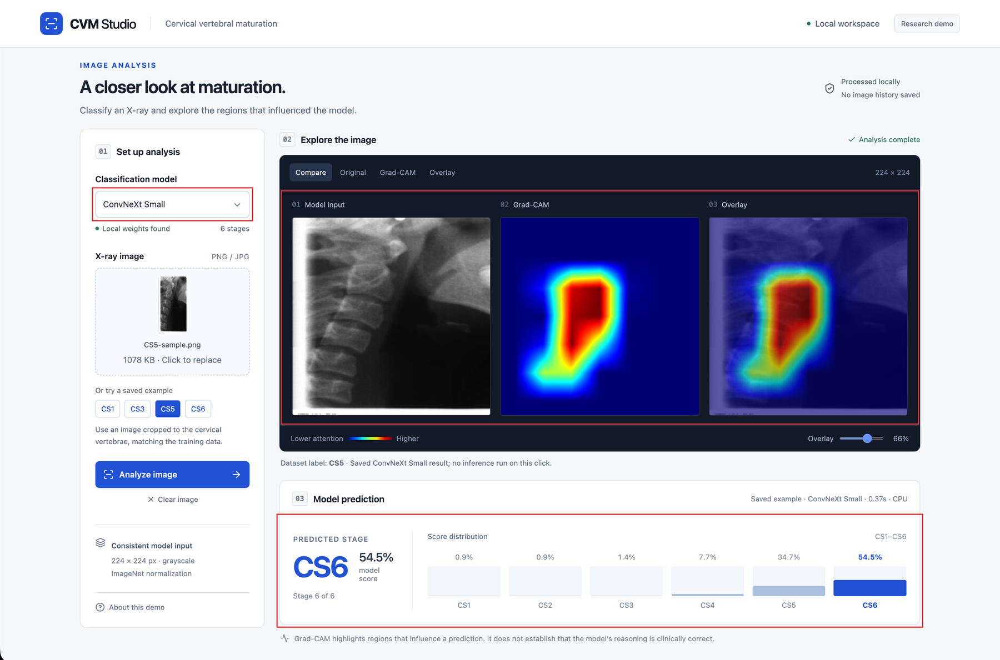
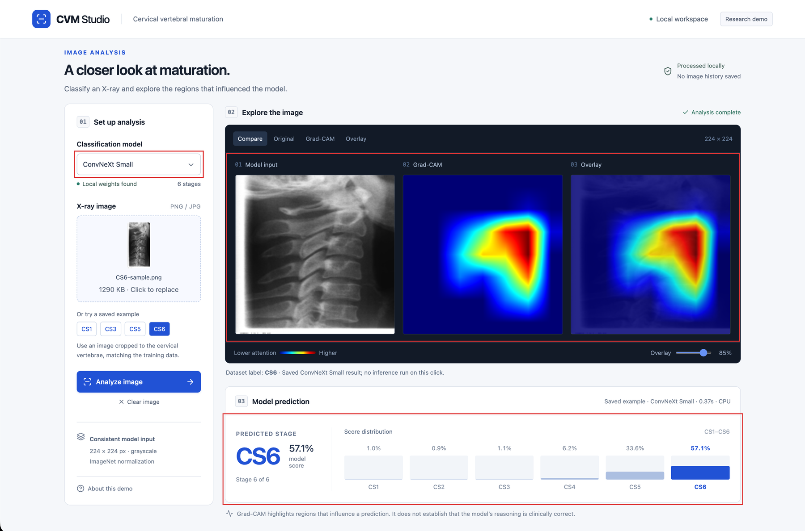

# CVM Studio

Local research demo for cervical vertebral maturation classification. Upload a
cropped lateral cephalometric X-ray, pick a model, and inspect six class scores
plus Grad-CAM.

Originally a Streamlit final-year project; the UI is now Vue 3 + FastAPI.
Training is unchanged. **Not for clinical diagnosis.**









## Run

```sh
python3 -m venv .venv
source .venv/bin/activate
python -m pip install -r requirements.txt
npm --prefix frontend ci
npm --prefix frontend run build
python main.py
```

Open http://127.0.0.1:8000

## Models

Weights are not in Git. Put the `.pth` files in `artifacts/checkpoints/`:

| File | Dropdown |
| --- | --- |
| `convnext-small.pth` | ConvNeXt Small |
| `densenet121.pth` | DenseNet121 |
| `mobilenet-v2.pth` | MobileNetV2 |
| `efficientnet-b1.pth` | EfficientNet-B1 |

The UI lists whatever is present. Nothing is downloaded at runtime.

## Dataset

CVM-900 is not in this repository. Citation: [DATASET.md](DATASET.md).

## License

Project code: [MIT](LICENSE). Dataset and model rights are separate.
